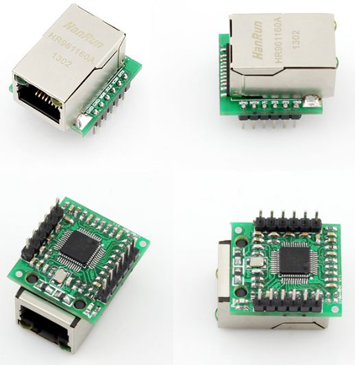
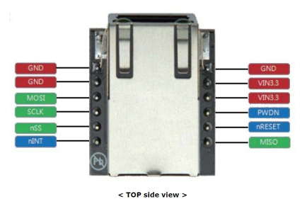

# Bluepill + W5500 Ethernet MQTT Client using PlatformIO 

# Description 

This project uses a "W5500 lite" board (also called DEVMO USR-ES1) connected to a standard BluePill board (STM32F103C8).



The code is a slight extension of the original `ArduinoEthernetShield.ino` (https://github.com/256dpi/arduino-mqtt/blob/master/examples/ArduinoEthernetShield/ArduinoEthernetShield.ino) sketch with the addition of reading out the supply voltage of the board. 

No changes to the Ethernet or arduino-mqtt library have been made.

# Wireup

Refer module datasheet for details. 



* Power pins: All GNDs to Bluepill's GNDs, all VIN3.3 pins to Bluepill's 3.3V 
	* since the module is power-hungry, extra decoupling capacitors on the 3.3V rail are recommended
* SPI: use default SPI1 (SCK = PA5, MISO = PA6, MOSI = PA7) and arbitrary chip select (here CS = PA4)
* nRESET of W5500 module **must** be tied to 3.3V, otherwise the chip won't start
* INT and POWERDOWN are not used

# Expected output

The `Serial` UART output is on PA9 at 115200 baud. 

The sketch should start with detecting the W5500 chip and getting an IP address via DHCP. It then connects to a public MQTT broker, subscribes to the "/hello" topic and regularly publishes a dummy message in the topic.

```
W5500 detected
Local IP is  192.168.1.237
connecting...
connected!
Incoming: from topic "/hello" Payload "01234567890123456789012345678901234567890123456789012345678901234567890123456789012345678901234567890123456789012345678901234567890123456789012345678901234567890123456789012345678901234567890123456789012345678901234567890123456789012345678901234567890123456789012345678901234567890123456789012345678901234567890123456789012345678901234567890123456789012345678901234567890123456789012345678901234567890123456789012345678901234567890123456789012345678901234567890123456789012345678901234567890123456789012345678901234567890123456789012345678901234567890123456789012345678901234567890123456789012345678901234567890123456789012345678901234567890123456789012345678901234567890123456789012345678901234567890123456789012345678901234567890123456789012345678901234567890123456789012345678901234567890123456789"
Incoming: from topic "/hello" Payload "world"
Incoming: from topic "/hello" Payload "world"
Incoming: from topic "/hello" Payload "world"
Incoming: from topic "/hello" Payload "world"
Publishing message to /hello: "world"
Incoming: from topic "/hello" Payload "world"
Incoming: from topic "/hello" Payload "world"
Incoming: from topic "/hello" Payload "world"
Incoming: from topic "/hello" Payload "world"
Incoming: from topic "/hello" Payload "world"
Incoming: from topic "/hello" Payload "world"
Incoming: from topic "/hello" Payload "world"
```

# Technical Documents 

* Datasheet W5500 Module: https://www.usriot.com/download/ES1/USR-ES1-EN-V1.0.pdf
* Datasheet W5500 chip: http://wizwiki.net/wiki/lib/exe/fetch.php/products:w5500:w5500_ds_v109e.pdf
* STM32Duino Bluepill pinout: https://stm32duinoforum.com/forum/wiki_subdomain/index_title_Blue_Pill.html